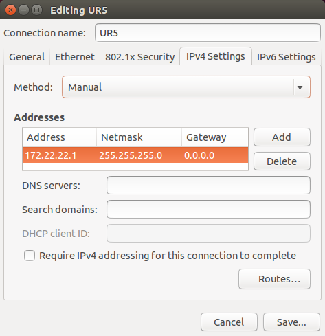

UR5 Complete Setup Guide
===
Author: [Long Qian](http://longqian.me/aboutme)

Date: 2016-09-05

## Overview
This tutorial demonstrates how to setup the interface between [UR5](http://www.universal-robots.com/products/ur5-robot/) robot and a PC, so that **the PC can control the UR5**.
I found the tutorials online are overwhelming complicated, and not well organized. The steps should be as easy and clear as this one.

### Hardware
You need a UR5 robot, a PC, and an ethernet cable.

### Software
* On UR5 side, PolyScope provides the interface to transfer data through TCP/IP, and to control the robot.
* On PC side, any program runs TCP/IP service is fine. [Matlab](http://www.mathworks.com/products/matlab/) is used in this guide.

## Steps
1. Unpack the UR5 and mount it properly. Please refer to [UR5 manual](http://www.universal-robots.de/uploads/media/ur5_user_manual_gb.pdf).
2. Plug in the power, and initialize the robot according to the instructions displayed on screen, also see the [manual](http://www.universal-robots.de/uploads/media/ur5_user_manual_gb.pdf).
3. Setup UR5 network:
	* Navigate to ```Setup Robot / Setup Network```
	* Check ```Static Address```
	* Input a reasonable IP address, e.g. ```172.22.22.2```
	* Input Netmask as ```255.255.255.0```, Gateway and DNS server as ```0.0.0.0```
4. Install Matlab on PC, including [Instrument Control Toolbox](http://www.mathworks.com/products/instrument/), which provides simple TCP/IP interface
5. Setup PC network:
	* Choose static IP address, e.g ```172.22.22.1```
	* Input Netmask as ```255.255.255.0```, Gateway and DNS server as ```0.0.0.0```. On Ubuntu, the setting looks like this. <div align="center"></div>

6. Connect the UR5 and PC using an Ethernet cable
7. Upload PolyScope client program
	* Prepare a USB stick
	* Download UR Magic file that uploads PolyScope programs on your USB stick to the UR5 controller: [urmagic_upload_programs.sh](http://www.universal-robots.com/download/?option=16588#section16578). You can also find a copy of it in ```urmagic/urmagic_upload_programs.sh```
	* Copy the ```polyscope``` folder to the USB stick
	* Plug the USB stick into the teach pendant of UR5, follow the [instructions](http://www.universal-robots.com/download/?option=16588#section16578)
8. Launch Matlab and navigate to ```example``` folder.
9. Run ```ur5_setup_example.m```. You can try out different joint configuration.
10. Done!


## Notes
* If your PC has only one Ethernet port, and you would like to connect to UR5 and Internet at same time, then you have several choices:
	1. Purchase an [Ethernet-to-USB adapter](https://www.google.com/#q=ethernet+to+usb+adapter), and plug one of the Etherent cable in the USB slot.
	2. Purchase a [network switch](https://www.google.com/#q=network+switch), and connect both UR5 and PC to the switch.
	3. Purchase and install another [Ethernet card](https://www.google.com/#q=ethernet+card) on your PC.
* This setup is mainly used for educational purposes.
* Thanks to **[Noah Cowan](http://limbs.lcsr.jhu.edu/people/cowan/)** and **Fereshteh Aalamifar** for their [initial work](https://www.mathworks.com/matlabcentral/fileexchange/50655-ur5-control-using-matlab).

